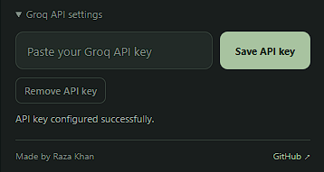

# WTFDoesThisMean

A Chrome extension that helps you understand English words, learn how to use them naturally, and actually remember them.

## Why I made it

I look up words all the time while reading articles, watching videos, or scrolling the internet (manga too 🌚).

The problem: dictionaries tell you what a word means, but not how people actually use it. And even when I understood a word, I forgot it a few days later and looked it up again. (Classic.)

So this extension does two things:

1. Explains a word in simple English with two everyday American English examples (no textbook energy).
2. Saves every word you look up, so you can revise it instead of searching again.

And it lives right in your browser. Pretty convenient, isn't it? (ik ik)

## What it does

- Simple explanation of the word
- Part of speech (noun, verb, adjective, etc.)
- Two conversational examples
- Saves explained words automatically
- Lets you browse your saved words
- Lets you delete the ones you don't need

## Screenshots

**Explaining a word**

**Saved vocabulary**

**API settings** (you add your own Groq API key here)

## How it works

The extension calls the Groq API with the `openai/gpt-oss-20b` model to generate the explanation and examples. You need your own Groq API key.

## Setup

You don't need Node.js or npm if you're downloading the ready-to-use release.

### Step 1: Download

[**Download WTFDoesThisMean v0.1.0**](https://github.com/khanrazadev/wtf-does-this-mean/releases/latest)

Under Assets, download `wtf-does-this-mean-v0.1.0.zip`.

**Important:** Download the ZIP under Assets, not the GitHub Source code ZIP.

### Step 2: Extract the ZIP

1. Find the downloaded ZIP on your computer.
2. Right-click it and select **Extract All** (Windows).
3. Open the extracted folder.
4. Make sure you can see `manifest.json` inside it.

Keep this folder somewhere safe. Don't delete it while using the extension.

### Step 3: Load it in Chrome

1. Open `chrome://extensions/` in a new tab.
2. Turn on **Developer mode**.
3. Click **Load unpacked**.
4. Select the extracted folder containing `manifest.json`.
5. Open the extension.

### Step 4: Load it in Brave

1. Open `brave://extensions/` in a new tab.
2. Turn on **Developer mode**.
3. Click **Load unpacked**.
4. Select the extracted folder containing `manifest.json`.
5. Open the extension.

### Step 5: Add your Groq API key

1. Visit [Groq Console](https://console.groq.com/).
2. Sign in and create an API key.
3. Open WTFDoesThisMean in your browser.
4. Expand **Groq API settings**.
5. Paste your API key and click **Save API key**.

That's it. Start looking up words!

### Updating the extension

When a new version is released:

1. Download the latest ZIP from [GitHub Releases](https://github.com/khanrazadev/wtf-does-this-mean/releases/latest).
2. Extract it into a new folder.
3. Open your browser's extensions page.
4. Remove the old installation.
5. Click **Load unpacked** and select the new extracted folder.

Your saved vocabulary and API key may not carry over when you remove the old installation. Back up anything important before updating.

## What I want to add next

- Right-click a selected word on any webpage to explain it (way less effort)
- Better ways to revise saved words
- Ways to organize saved words
- A hosted backend, so people don't need their own API key (the dream)

## Built with

TypeScript, Vite, Chrome Extension APIs, Groq API

## Privacy

Your saved words and your API key stay in your browser. The words you ask about are sent to Groq so it can generate the answer. No account needed (I don't want your email anyway, Unless...).

Read our full [Privacy Policy](PRIVACY.md).

## Contributing

Found a bug or have an idea? Open an issue or send a PR. (Be nice, it's a small project.)